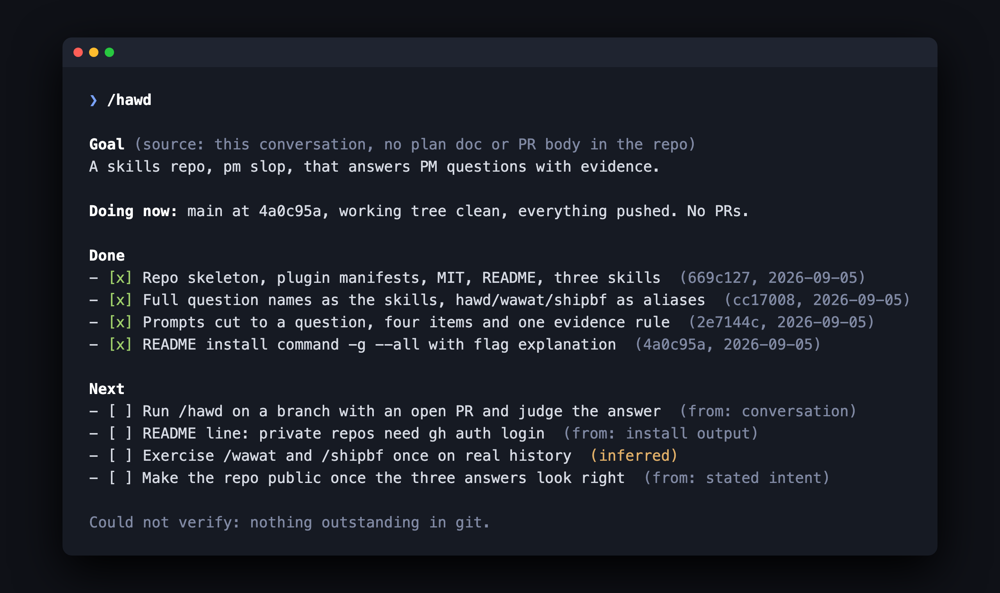
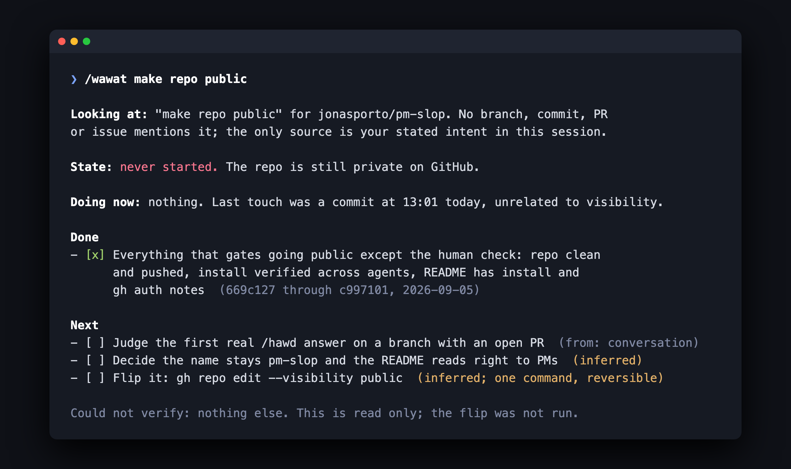
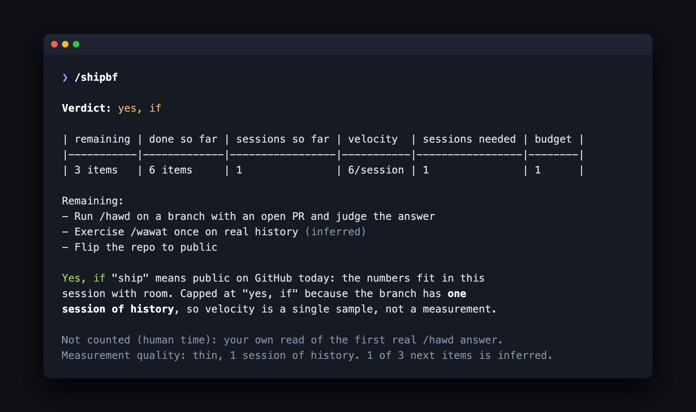

# pm slop

Answers to the questions PMs ask. The question is slop. The answer is not.

| you ask | you type | you get |
|---|---|---|
| how are we doing on this? | [`/how-are-we-doing-on-this`](./skills/how-are-we-doing-on-this/SKILL.md) or [`/hawd`](./skills/hawd/SKILL.md) | goal, doing now, done checklist, next checklist |
| where are we at with X? | [`/where-are-we-at-with-x X`](./skills/where-are-we-at-with-x/SKILL.md) or [`/wawat X`](./skills/wawat/SKILL.md) | which X it found, its state, then the same checklist |
| can we ship this by Friday? | [`/can-we-ship-this-by-friday [N]`](./skills/can-we-ship-this-by-friday/SKILL.md) or [`/shipbf [N]`](./skills/shipbf/SKILL.md) | yes / no / yes-if, from measured pace, in agent sessions |

Every done item carries a commit. Every next step carries its source (plan
doc, PR body, review comment, failing check, TODO) or the label `(inferred)`.
The skills never invent green. You also do not need the slash: "any updates?"
and "did the auth thing ship?" trigger them on their own.

## Installation

Two routes. **`npx skills`** copies the skill files into your agents, all of
them at once, as files you own and can edit. **The Claude Code plugin** is a
managed bundle that updates when this repo ships. Pick one; both at once gives
you every skill twice.

### Codex, Claude Code, Cursor, and every other agent

```bash
npx skills@latest add jonasporto/pm-slop -g --all
```

`-g` installs for the user, so the skills work in every checkout. `--all`
takes every skill and every agent it finds without asking. Drop either to
pick. Update later with `npx skills update -g`.


### Claude Code plugin

```
/plugin marketplace add jonasporto/pm-slop
/plugin install pm-slop@pm-slop
```

The plugin route namespaces the commands: `/pm-slop:hawd`.


Needs `git`. With `gh` installed you also get PRs, issues, reviews and CI
checks; without it the answer says what it could not verify.

## Ask mid-session

The questions land best in the middle of a working session, when the agent
already knows what "this" is. In Claude Code, `/btw` runs a skill in a fork
without interrupting the work in flight:

```
/btw /hawd
/btw /shipbf 2
```

The fork inherits the conversation, so "this" means the work you are talking
about, not merely the directory you are standing in. Other agents: run the
skill as a normal turn, it is read only and leaves the work as it found it.

## What the answers look like

All three are real, from this repo on the day it was written.

### /hawd



### /wawat make repo public



### /shipbf



## Friday in agent time

`can-we-ship-this-by-friday` does not use calendar days. A person measures
work in days; an agent measures it in sessions, one focused window of
context. A Friday is a budget of sessions, default one (this session).
`/shipbf 3` asks whether the rest fits in three. Pace comes from the branch's
own commit history, bursts of commits split by 90 minute gaps, so the estimate
is measured on this work, not guessed. With less than two sessions of history
the best verdict is "yes, if", and it says why.

## It's working if

- A done item you did not recognise has a hash, and the hash is real.
- A next step you did not plan says `(inferred)`.
- "Stalled" comes with a date. "No" comes with a number of sessions.
- The goal is quoted from somewhere, and the answer says where.

## Contributing

One skill is one PM question. The folder name is the question in kebab-case,
plus an alias folder with the acronym people actually type. The frontmatter
`description` lists the ways the question is asked in real life, because that
is what triggers the skill when nobody types the slash. The rest of the rules
are in [`AGENTS.md`](./AGENTS.md). Changes that a user would notice get a
changeset (`npx changeset`); the release workflow does the rest.

## License

MIT
